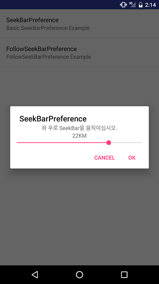

# SeekBarPreference
SeekBarPreference is an android library to help using preference with SeekBar.

## Usage
You can use SeekBarPreference on gradle.

    repositories {
        jcenter()
    }
    dependencies {
      compile 'com.yokkomi:seekbar-preference:1.0'
    }

## XML
### Basic SeekBarPreference
    <com.yokkomi.commons.preference.seekbar.SeekBarPreference
        android:defaultValue="0"
        android:key="@string/seekbarpreference"
        android:summary="@string/seekbarpreference_summary"
        android:title="@string/seekbarpreference"
        app:explain="@string/seekbarpreference_explain"
        app:maxValue="30"
        app:padding="3"
        app:unit="KM" />

### Follow SeekBarPreference
    <com.yokkomi.commons.preference.seekbar.FollowSeekBarPreference
        android:defaultValue="0"
        android:key="@string/followseekbarpreference"
        android:summary="@string/followseekbarpreference_summary"
        android:title="@string/followseekbarpreference"
        app:explain="@string/followseekbarpreference_explain"
        app:maxValue="30"
        app:padding="3"
        app:unit="KM" />
